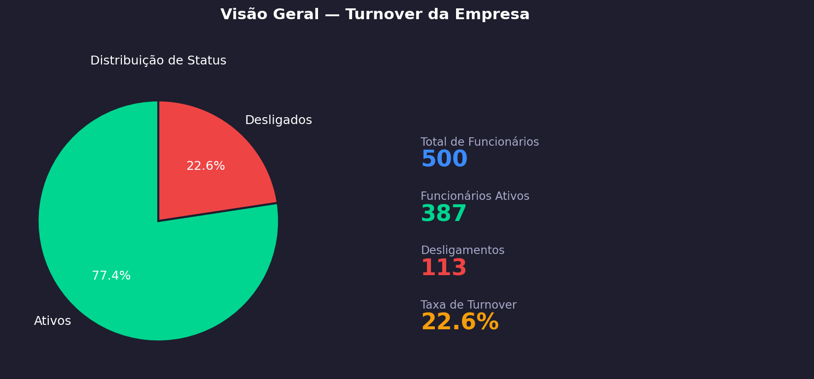
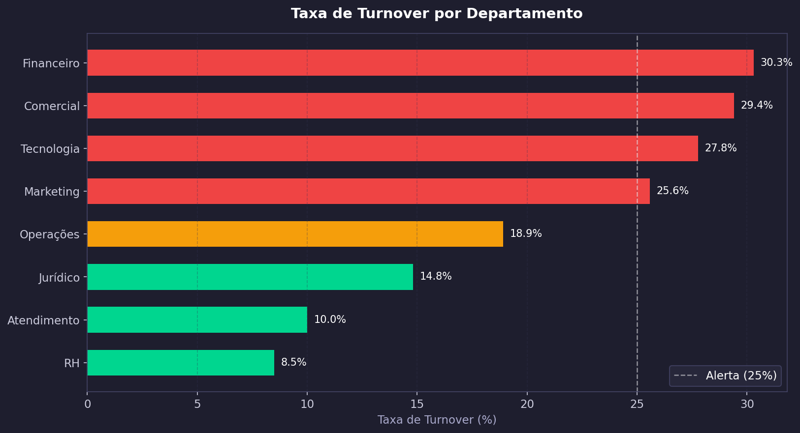
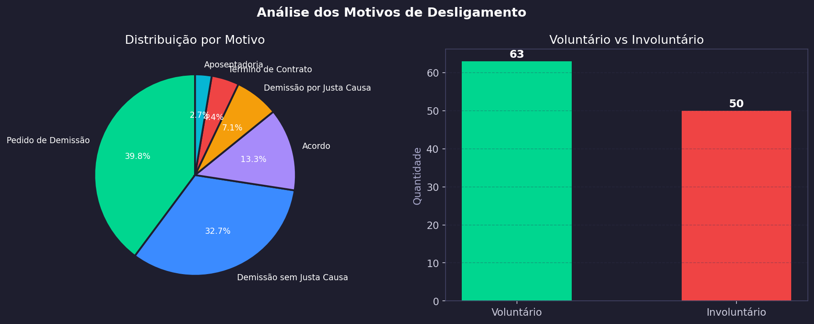
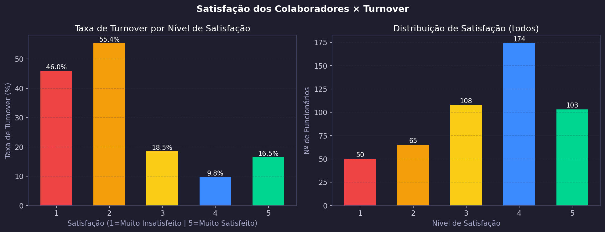
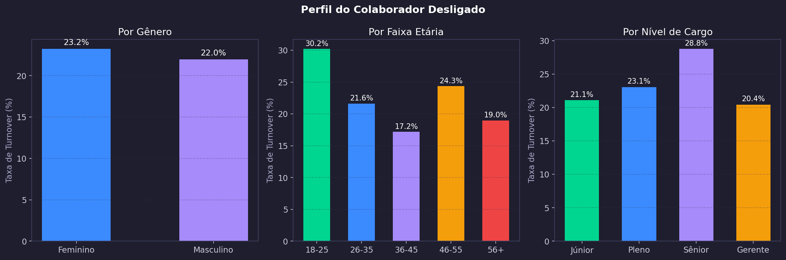
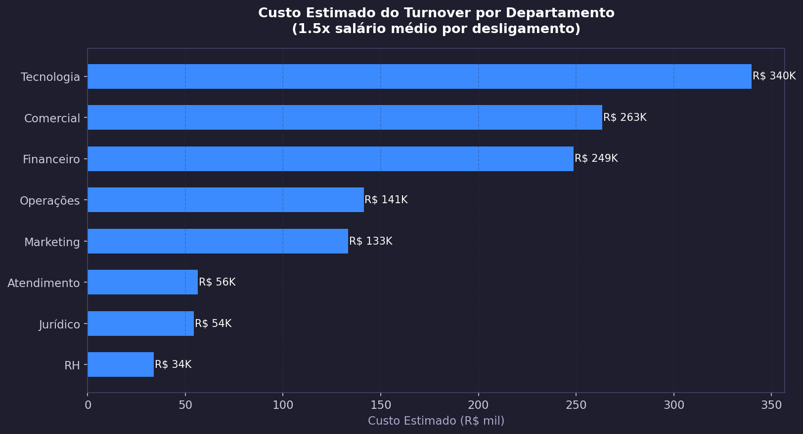
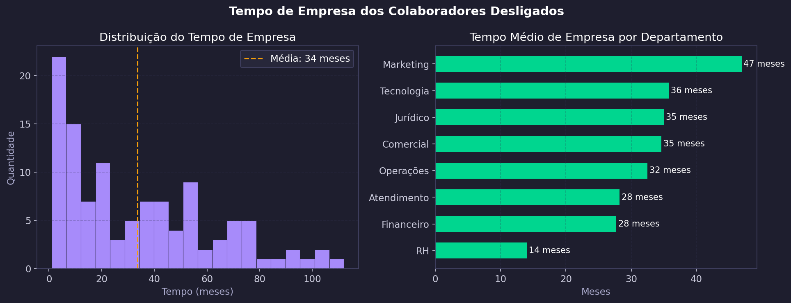

# 👥 Análise de RH — Turnover e Gestão de Pessoas

> Projeto completo de análise de dados de Recursos Humanos com dados sintéticos gerados em Python, banco de dados MySQL, exportação para Excel e dashboard interativo no Power BI.


---

## 📸 Dashboard Power BI

> Dashboard interativo com tema escuro, filtros por departamento, status, gênero e nível de cargo.


---

## 🤖 Gráficos Gerados Automaticamente pelo Python

> Ao executar o script `analise_rh.py`, todos os gráficos abaixo são gerados automaticamente.

### 📊 Visão Geral — Turnover da Empresa

> Taxa de turnover de **22,6%** — 113 de 500 funcionários desligados no período analisado.

---

### 🏢 Turnover por Departamento

> **Financeiro (30,3%)** e **Comercial (29,4%)** são os departamentos mais críticos, ambos acima do limite de alerta de 25%.

---

### 📋 Motivos de Saída

> **Pedido de Demissão (39,8%)** é o principal motivo — indica problema de retenção. 55,8% dos desligamentos são voluntários.

---

### 😟 Satisfação × Turnover

> Colaboradores com **satisfação nível 2 têm 55,4% de turnover** — correlação direta entre insatisfação e saída.

---

### 👤 Perfil do Colaborador Desligado

> Faixa **18-25 anos** tem maior rotatividade (30,2%). Nível **Sênior** apresenta turnover de 28,8% — sinal de perda de talentos.

---

### 💰 Custo Estimado do Turnover

> **Tecnologia** lidera com **R$ 340K** em custo estimado de turnover (1,5x salário médio por desligamento).

---

### ⏱️ Tempo de Empresa dos Desligados

> Média de **34 meses** antes do desligamento. **RH** perde colaboradores em apenas **14 meses** — o menor tempo da empresa.

---

## 📌 Principais Insights

- 📉 Taxa de turnover de **22,6%** — acima da média saudável de 10-15%
- 🚨 **Financeiro (30,3%)** e **Comercial (29,4%)** em nível crítico
- 😟 Colaboradores com **satisfação 2 têm 55,4% de chance de sair**
- 👶 Faixa **18-25 anos** é a mais volátil — 30,2% de turnover
- 💸 **Tecnologia** gerou **R$ 340K** em custo de turnover
- ⏱️ **RH** perde talentos em média em **14 meses**
- 📋 **39,8% dos desligamentos** são pedidos de demissão

---

## 🎯 Perguntas de Negócio Respondidas

- Qual a **taxa de turnover** geral da empresa?
- Quais **departamentos** têm maior rotatividade?
- Qual o **perfil** do colaborador que mais sai?
- Qual o **custo estimado** do turnover por departamento?
- Como a **satisfação** impacta o turnover?
- Qual o **tempo médio** de empresa antes do desligamento?

---

## 🗂️ Estrutura do Repositório

```
analise-rh-turnover/
│
├── scripts/
│   ├── rh_criar_banco.sql          # Criação do banco e tabelas MySQL
│   ├── gerar_dados_rh.py           # Geração de 500 funcionários sintéticos
│   ├── analise_rh.py               # EDA + geração automática de gráficos
│   └── exportar_excel_rh.py        # Exportação para Excel formatado
│
├── dados/
│   └── rh_analytics.xlsx           # Base exportada com 4 abas formatadas
│
├── dashboard/
│   └── rh_turnover.pbix            # Dashboard Power BI interativo
│
├── images/
│   ├── dashboard_rh.png            # Print do dashboard Power BI
│   ├── 01_turnover_geral.png
│   ├── 02_turnover_departamento.png
│   ├── 03_motivos_saida.png
│   ├── 04_satisfacao_turnover.png
│   ├── 05_perfil_desligado.png
│   ├── 06_custo_turnover.png
│   └── 07_tempo_empresa.png
│
└── README.md
```

---

## 🗄️ Modelagem do Banco de Dados (MySQL)

```
departamentos        cargos
─────────────        ──────
departamento_id ──►  cargo_id
nome                 nome
gestor               nivel
orcamento            salario_base
                     departamento_id ──►

funcionarios              historico_turnover
────────────              ──────────────────
funcionario_id            turnover_id
nome                      funcionario_id ──►
genero                    data_saida
idade                     motivo_saida
nivel_educacao            tipo
departamento_id ──►       departamento_id ──►
cargo_id ──►              cargo_id ──►
salario                   salario
satisfacao                tempo_empresa
avaliacao_desempenho
status
```

---

## 🛠️ Tecnologias Utilizadas

| Ferramenta | Finalidade |
|---|---|
| Python 3 | Geração de dados sintéticos + automação de gráficos |
| MySQL | Banco de dados relacional com 4 tabelas |
| Pandas | Manipulação e tratamento de dados |
| Matplotlib / Seaborn | Geração automática de 7 visualizações |
| Excel (openpyxl) | Exportação formatada com 4 abas |
| Power BI | Dashboard interativo com tema escuro |

---

## ▶️ Como Executar

**Pré-requisitos:**
- Python 3.8+
- MySQL rodando localmente
- Power BI Desktop

**Instalação:**
```bash
pip install pandas matplotlib seaborn pymysql openpyxl
```

**Passos:**

1. Clone o repositório
```bash
git clone https://github.com/GabrielCruz079/analise-rh-turnover.git
```

2. Crie o banco de dados
```bash
mysql -u root -p < scripts/rh_criar_banco.sql
```

3. Gere os dados sintéticos
```bash
python scripts/gerar_dados_rh.py
```

4. Execute a análise — gráficos gerados automaticamente
```bash
python scripts/analise_rh.py
```

5. Exporte para Excel
```bash
python scripts/exportar_excel_rh.py
```

6. Abra o `dashboard/rh_turnover.pbix` no Power BI Desktop

---

## 👨‍💻 Autor

**Gabriel Ramos Cruz**
Cientista de Dados em Formação | Ciência da Computação — Cruzeiro do Sul

[](https://linkedin.com/in/gabriel-ramos-50a081357)
[](https://github.com/GabrielCruz079)
[](https://gabrielcruz079.github.io)
